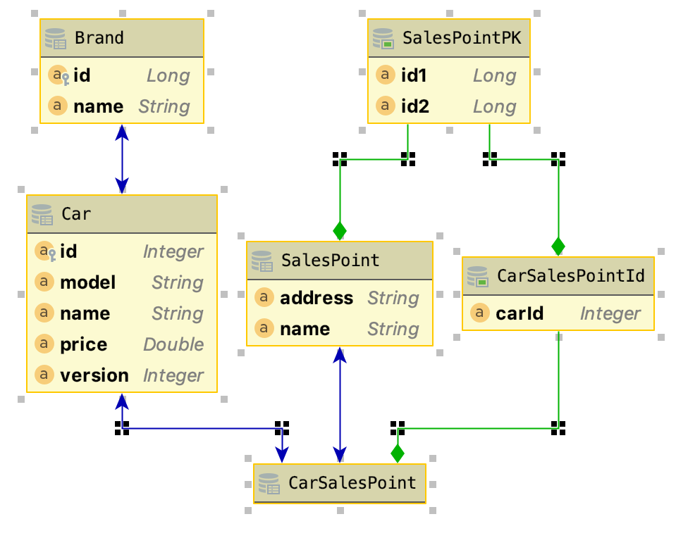

= Quarkus Criteria Extension
:page-layout: base
:source-language: java
:icons: font
:linkattrs:
:sectanchors:
:sectlink:
:doctype: book
:toc: preamble
:tip-caption: :bulb:
:note-caption: :information_source:
:important-caption: :heavy_exclamation_mark:
:caution-caption: :fire:
:warning-caption: :warning:

image:https://github.com/quarkus-criteria/quarkus-criteria/workflows/Quarkus%20Criteria%20Build/badge.svg[Build Status, link=https://github.com/quarkus-criteria/quarkus-criteria/actions?query=workflow%3A%22Quarkus+Criteria+Build%22]
image:https://coveralls.io/repos/github/quarkus-criteria/quarkus-criteria/badge.svg?branch=master[Coverage, link=https://coveralls.io/github/quarkus-criteria/quarkus-criteria?branch=master]
image:https://img.shields.io/maven-central/v/com.github.quarkus.criteria/quarkus-criteria.svg?label=Maven%20Central["Maven Central",link="https://search.maven.org/search?q=g:com.github.quarkus.criteria%20AND%20a:quarkus-criteria"]

Enables type safe and fluent criteria API for Quarkus applications via https://deltaspike.apache.org/documentation/data.html#JPACriteriaAPISupport[DeltaSpike Criteria^].

== Usage

* Add the following dependency:
+
[source, xml]
----
<dependency>
    <groupId>com.github.quarkus-criteria</groupId>
    <artifactId>quarkus-criteria</artifactId>
    <version>1.0.0-RC1</version>
</dependency>
----

* Create a JPA entity which implements `PersistenceEntity` or extend `BaseEntity`
+
[source,java]
----
@Entity
@Table(name = "car")
public class Car extends BaseEntity {

    @Id
    @GeneratedValue(strategy = GenerationType.AUTO)
    private Integer id;

    @Column(name = "model")
    private String model;

    @Column(name = "name")
    private String name;

    @Column(name = "price")
    private Double price;

    @OneToOne
    private Brand brand;

    @oneToMany
    private List<CarSalesPoint> salesPoints;

    @Version
    private Integer version;

    @Override
    public Integer getId() {
        return id;
    }
----

* To have `type safe` queries you need to enable JPA metamodel generation on your build:
+
----
<plugin>
    <groupId>org.bsc.maven</groupId>
    <artifactId>maven-processor-plugin</artifactId>
    <version>3.3.2</version>
    <executions>
        <execution>
            <id>process</id>
            <phase>generate-sources</phase>
            <goals>
                <goal>process</goal>
            </goals>
            <configuration>
                <processors>
                    <processor>org.hibernate.jpamodelgen.JPAMetaModelEntityProcessor</processor>
                </processors>
            </configuration>
        </execution>
    </executions>
    <dependencies>
        <dependency>
            <groupId>org.hibernate</groupId>
            <artifactId>hibernate-jpamodelgen</artifactId>
            <version>5.2.12.Final</version>
        </dependency>
    </dependencies>
</plugin>
----
+
TIP: See https://docs.jboss.org/hibernate/orm/5.0/topical/html/metamodelgen/MetamodelGenerator.html#_usage_within_the_ide[this tutorial^] for configuring it on your IDE.

* Now you're ready to use https://deltaspike.apache.org/documentation/data.html#JPACriteriaAPISupport[DeltaSpike type safe fluent criteria API] on your Quarkus application

For examples below consider the following entities:

=== Examples

The easiest way to use quarkus criteria is via *generic injection* of `CrudService`:

[source, java]
----
@Inject
@Service
CrudService<Car> crudService;
----

Below are some example criteria you can create:

* List cars by brand name:

[source, java]
----
List<Car> carsFound = crudService.criteria()
        .fetch(Car_.brand)
        .join(Car_.brand, crudService.where(Brand.class)
            .eqIgnoreCase(Brand_.name, "tesla"))
        .getResultList();

assertThat(carsFound).isNotNull().hasSize(2)
        .extracting("name")
        .contains("Model S", "Model X");
----

* List brands by sales point address:

[source, java]
----
@Inject
CrudService<Brand> brandCrud;

List<Brand> brands = brandCrud.criteria().distinct()
        .join(Brand_.cars, brandCrud.where(Car.class)
                .join(Car_.carSalesPoints, brandCrud.where(CarSalesPoint.class)
                     .join(CarSalesPoint_.salesPoint, brandCrud.where(SalesPoint.class)
                        .eq(SalesPoint_.address, "Tesla HQ address")))
              )
        .getResultList();
assertThat(brands).isNotNull().hasSize(1)
        .extracting(brand -> brand.getName())
        .contains("Tesla");
----

* List cars by model, brand name and sales point address:

[source, java]
----
List<Car> result = rudService.criteria()
   .distinct()
   .fetch(Car_.carSalesPoints, JoinType.LEFT) // fetches salesPoint list in result
   .fetch(Car_.brand)
   .join(Car_.brand, where(Brand.class)
        .or(crudService.criteria(Brand.class).eq(Brand_.name, "Nissan"), //by brand name
           crudService.criteria(Brand.class).eq(Brand_.name, "Ford")))
   .join(Car_.carSalesPoints, crudService.where(CarSalesPoint.class, JoinType.LEFT)  //by toMany association property (address)
        .join(CarSalesPoint_.salesPoint, crudService.where(SalesPoint.class, JoinType.LEFT) // car -> carSalesPoint -> salesPoint.address
                .eqIgnoreCase(SalesPoint_.address, "ford motors address")))
   .or(criteria().likeIgnoreCase(Car_.model, "%tanium"),
                 crudService.criteria().eq(Car_.name, "Sentra"))
   .getResultList();

----

* Aggregation function

[source, java]
----
Double result = criteria()
    .select(Double.class, sum(Car_.price))
    .likeIgnoreCase(Car_.model, model)
    .getSingleResult();
----

* Count by criteria

[source, java]
----
long count = crudService.count(crudService.criteria()
            .likeIgnoreCase(Car_.model, "%porche%")
            .gtOrEq(Car_.price, 10000D));
----

* Insert

[source, java]
----
List.of(new Brand().setName("Nissan"),
        new Brand().setName("Ford"),
        new Brand().setName("Tesla"))
          .forEach(brandCrud::insert);

----

* Delete in batches

[source, java]
----
int deleted = crudService.removeBatch(crudService.criteria().getResultList(), 5);
assertThat(deleted).isEqualTo(10);
assertThat(crudService.count()).isEqualTo(0L);
----

[TIP]
====
You can also inherit from CrudService, this way you can invoke `where`, `criteria()` and other methods directly from superclass instead of calling them via crudService instance:

[source, java]
----
@Transactional(Transactional.TxType.SUPPORTS)
public class CarService extends CrudService<Car> implements Serializable {

 public List<CarWithNameAndPrice> getCarsAndMapToDTO() {
        List<CarWithNameAndPrice> carsDTO = criteria()
                .select(CarWithNameAndPrice.class, attribute(Car_.name), attribute(Car_.price)) <1>
                .join(Car_.brand, where(Brand.class)
                        .or(criteria(Brand.class)
                                        .eq(Brand_.name, "Nissan"),
                                criteria(Brand.class).eq(Brand_.name, "Tesla")))
                .join(Car_.salesPoints, where(SalesPoint.class)
                        .likeIgnoreCase(SalesPoint_.name, "%Tesla%")).getResultList();
        return carsDTO;

}
----
<1> Select fields and target DTO to map results

====

* Pagination

[source, java]
----
    /**
     * curl -X GET http://localhost:8080/api/cars -v
     */
    @GET
    @Produces(MediaType.APPLICATION_JSON)
    public Response list(@QueryParam("first") @DefaultValue("0") Integer startPosition,
                         @QueryParam("pageSize") @DefaultValue("10") Integer maxResult,
                         @QueryParam("sortField") @DefaultValue("id") String sortField,
                         @QueryParam("sortField") @DefaultValue("ASCENDING") SortType sortType,
                         @QueryParam("name") @DefaultValue("") String name,
                         @QueryParam("model") @DefaultValue("") String model,
                         @QueryParam("price") Double price,
                         @QueryParam("brandId") Long brandId
                         ) {

        Filter<Car> carFilter = new Filter<>(new Car().setName(name)
                .setModel(model)
                .setPrice(price))
                .setFirst(startPosition)
                .setPageSize(maxResult)
                .setSortType(sortType)
                .setSortField(sortField);
        if(brandId != null) {
            carFilter.getEntity().setBrand(new Brand(brandId));
        }

        return ok(carService.paginate(carFilter)).build();
    }
----
TIP: `paginate` method will use `filter` to get pagination information and also call *configPagination* on your service so you can add restrictions or fetch additional fields, see https://github.com/quarkus-criteria/quarkus-criteria/blob/master/system-tests/src/main/java/com/github/quarkus/criteria/service/CarService.java#L28-L67[CarService for example^].

[TIP]
====
For more examples see:

* https://github.com/quarkus-criteria/quarkus-criteria/blob/master/it-tests/src/test/java/com/github/quarkus/criteria/CrudServiceIt.java#L28[Integration tests^]
* https://github.com/quarkus-criteria/quarkus-criteria/blob/master/system-tests/src/test/java/com/github/quarkus/criteria/CarRestIt.java#L26[System tests]
====

==== BaseCriteriaSupport

If you don't want CRUD support you can inherit directly from `BaseCriteriaSupport`:

[source, java]
----
@ApplicationScoped
public class CarCriteria extends BaseCriteriaSupport<Car> {
    /**
     * getEntityManager().createQuery("SELECT SUM(c.price) FROM Car c WHERE upper(c.model) like :model", Double.class)
     *                 .setParameter("model", model).getSingleResult();
     */
    public Double getTotalPriceByModel(String model) {
        return criteria()
                  .select(Double.class, sum(Car_.price))
                .likeIgnoreCase(Car_.model, model)
                .getSingleResult();
    }
}
----

==== Criteria by example

You can query by example using `exampleBuilder`:

[source, java]
----
 Car carExample = new Car().model("Ferrari");
 List<Car> cars = carService
      .exampleBuilder.of(carExample, ComparisonOperation)
      .usingAttributes(Car_.model).build() <1>
      .getResultList();

----
<1> select which attributes to consider from example entity, if no attribute is provided then non null properties from example entity  will be considered.

You can also choice the https://github.com/quarkus-criteria/quarkus-criteria/blob/master/runtime/src/main/java/com/github/quarkus/criteria/runtime/model/ComparisonOperation.java[comparison operarion^] to be used when comparing example attribute value:

[source, java]
----
Car carExample = new Car().setModel("%rrari");
List<Car> cars = carService
        .exampleBuilder.of(carExample)
        .usingAttributes(ComparisonOperation.LIKE_IGNORE_CASE, Car_.model).build()
        .getResultList();
----

If no comparisonOperation is provided then `EQ` will be used.

[source, java]
----
 Car carExample = new Car().model("Ferrari");
 List<Car> cars = carService
      .exampleBuilder.of(carExample, ComparisonOperation)
      .usingAttributes(Car_.model).build() <1>
      .getResultList();

----

Find cars by sales point address example:

[source, java]
----
SalesPoint salesPoint = new SalesPoint().setAddress("Tesla HQ address");
CarSalesPoint carSalesPointExample = new CarSalesPoint().setSalesPoint(salesPoint);

List<CarSalesPoint> carSalesPointsFound = carSalesPointCrud
        .exampleBuilder.of(carSalesPointExample)
        .usingAttributes(SalesPoint_.address)
        .build()
        .distinct()
        .fetch(CarSalesPoint_.salesPoint)
        .getResultList();
assertThat(carSalesPointsFound).isNotNull().hasSize(2);
List<Car> carsFound = carSalesPointsFound.stream()
        .map(carSalesPoint -> carSalesPoint.getCar())
        .collect(Collectors.toUnmodifiableList());
assertThat(carsFound).isNotNull().hasSize(2)
        .extracting("name")
        .contains("Model S", "Model X");
----
TIP: More examples https://github.com/quarkus-criteria/quarkus-criteria/blob/master/it-tests/src/test/java/com/github/quarkus/criteria/CriteriaByExampleIt.java#L27[can be found here].

== Integration tests

Integration tests are located in `it-tests` modules, to run them just run maven command:

`mvn test`

=== It tests cmdline app

It tests module has a sample cmdline app, to run it use:

`mvn package && java -jar target/quarkus-criteria-it-runner.jar`

Or run via quarkus:dev:

`mvn compile quarkus:dev`

== System tests

System tests are located in `system-tests` module, to run them use maven command:

`mvn test`

=== Native mode

To run system tests in native mode:

`mvn verify -Pnative`

To run native tests inside docker (without the need to install GraalVM):

* MacOS:
+
`mvn verify -Dquarkus.native.container-build=true -Dquarkus.native.builder-image=quay.io/quarkus/ubi-quarkus-mandrel:20.3-java11 -Pnative`
* Linux
+
`mvn verify -Dquarkus.native.container-build=true -Dquarkus.native.builder-image=quay.io/quarkus/ubi-quarkus-native-image:20.3.0-java11 -Pnative`